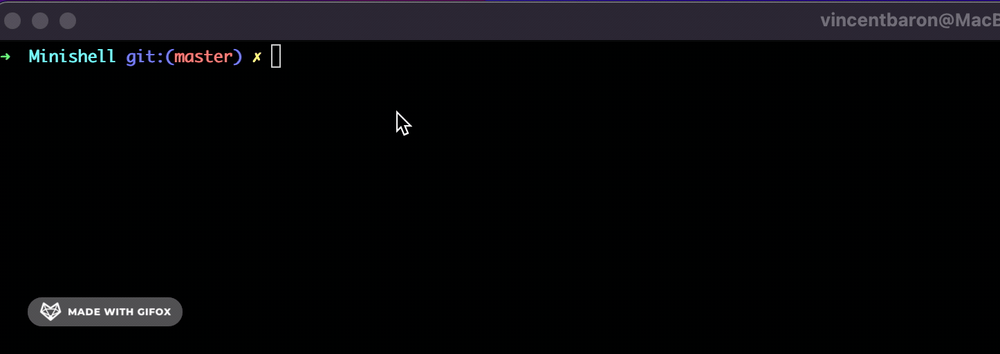
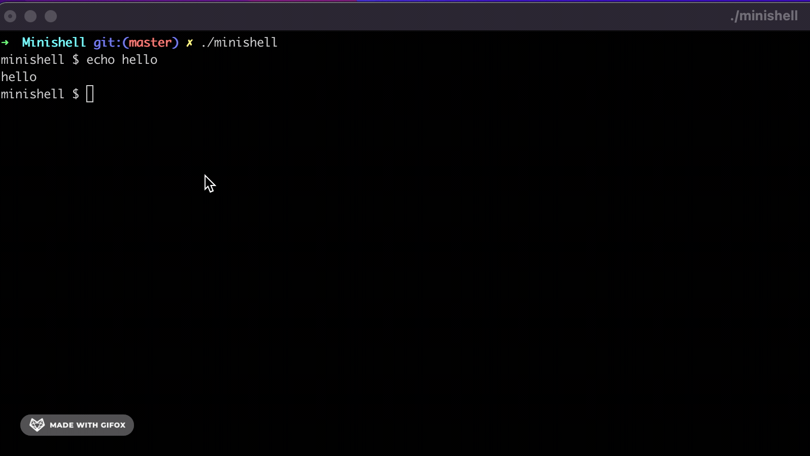
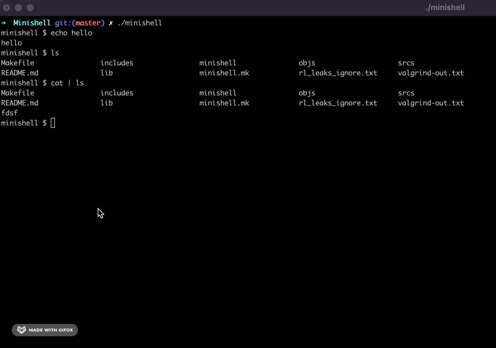

# Minishell
## Project overview

This one of the hardest group project of the 42 common core. Why? Because we have to code from scratch a bash command line in C. I worked on this project as a team with [Cyrena Cramdani](https://github.com/Cyren4). 

The end product had to reproduce identically the behaviour of a bash command line. Obviously not all of it had to be implemented since it would take years to reproduce.
You can see below the basic behaviour of our program with some typicall bash commands. The project will not be explained in its entirety since it is very detailled. However, the main concepts are explained below.

### Launching and executing "echo hello"

### Executing "ls" and "cat | ls"

### Executing "ls > test.txt" to redirect output of "ls" into "test.txt"

This project can be divided into two main parts:

1. Parsing.
2. Execution.

### Parsing

Parsing was done using a tokenized lexer/parser. Each element of the command was stored into a linked list with each element having a specific type (e.g. CMD, REDIR, PIPE, etc.). All $ variables were also converted.

### Execution

Execution was done using an AST (Abstract Synthax Tree). The point of using an AST is to simplify the execution process and be able to implement levels of priority in the command interpreter easily. It was not necessary for this project but I thought it would be fun to understand and implement.

On one part we had to recode built-in functions such as "cd", "pwd", etc. On the other hand we had to use the standard library function "execve" to execute all executables from bash (e.g. ls, cat, wc, etc.).

## What I learned

1. In depth Bash --posix.
2. Advanced multi-processing.
3. Process communication with pipes.
4. redirections ("<", ">", ">>").
5. dup2 function to redirect STDOUT content into a different process.
6. How heredocs work ("<< redirections").
7. Advanced fd managment.
8. TDD.
9. Signals overload (Ctr C, Ctrl D, etc.).
10. Readline fucntion and history to create the command line entry.
11. Advanced debugging and leaks managment (the most painful part... :sob:).
12. Abstract Syntax Trees (loved it :sunglasses:).
13. Lexer / Parsers.
14. Tokenizers.
15. Pids and processes managment (painfully with the reimplementation of the "cat | ls" commands :satisfied:).
16. Environment variables.

